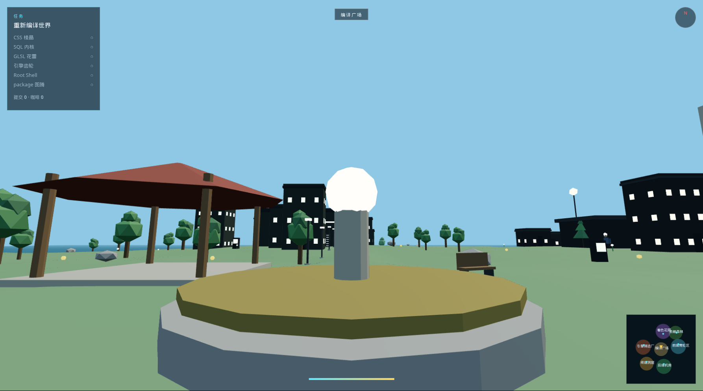

# 源码港 Bytehaven

用 **Blender 4.2 LTS** 程序化生成整座岛屿，再用 **Three.js** 做成可玩的第一人称 3D 开放世界。

世界设定在一座会「编译」的开发者群岛上：编译广场、前端霓虹区、后端机房、着色花园、引擎铸造厂、终端洞窟、依赖森林。内核碎成六片，你要把它们找回来。



## 玩法

1. 在广场和 **KERNEL** 对话，接取主线。
2. 自由探索七个区域（外加瞭望岛和神社小岛）。
3. 走进地标建筑，拾取六枚源码碎片。
4. 把碎片带回喷泉，重新编译世界。
5. 沿途收集提交（commits）和咖啡（回复奔跑体力）。

## 操作

| 按键 | 作用 |
|------|------|
| W A S D | 移动 |
| 鼠标拖动 或 ← → / Q | 视角 |
| Shift | 奔跑 |
| 空格 | 跳跃 |
| E | 交互 / 对话 / 拾取 |
| H | 帮助 |

## 工具链

| 工具 | 用途 |
|------|------|
| Blender 4.2 Python API + bmesh | 岛屿地形、地标、建筑、道具套件、角色、GLB 导出、Workbench 预览 |
| Three.js + WebGL | 实时渲染、天空、第一人称控制 |
| Vite | 开发服务器与打包 |

所有网格都由 `blender/generate_world.py` 生成，仓库不依赖外部模型库。无 GPU 时 Blender 预览可省略，游戏截图见 `public/assets/preview.png`。

## 运行

需要 Node 18+。玩的时候不需要本机安装 Blender，资产已经导出在 `public/assets/`。

```bash
npm install
npm run dev
```

打开 http://localhost:5173 ，点击「进入世界」。

## 重新生成资产

安装 [Blender 4.2+](https://www.blender.org/download/lts/4-2/)，然后：

```bash
# Linux 示例：把官方 tarball 解压后
export BLENDER=$HOME/blender/blender-4.2.23-linux-x64/blender
chmod +x scripts/generate-assets.sh
npm run assets
```

脚本会写出：

- `public/assets/world.glb` 地形、道路色、地标与房屋
- `public/assets/kit.glb` 树、灯、长椅、机架、角色等可实例化套件
- `public/assets/world.json` 高度图、碰撞盒、NPC、任务与采集物
- `public/assets/preview.png` 俯瞰预览

## 测试

```bash
npm test
```
