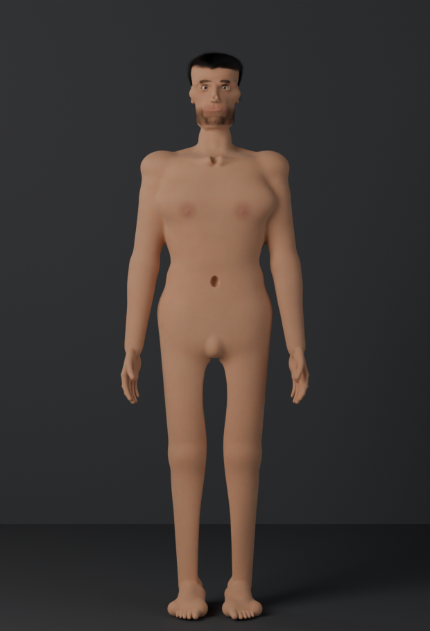

# humanlab — 用 Blender 程序化生成写实人体模型

用有符号距离场（SDF）雕塑一组解剖学上可信的人体，用 Blender 的 Cycles 做影棚渲染。
没有任何外部模型资产、没有 MakeHuman、没有商业角色库：几何全部由代码按人体测量学比例
生成，皮肤、毛发、眼睛的材质也全部是程序化的。

八个预设：成年男性、健美男性、纤瘦男性、丰满男性、成年女性、健美女性、儿童、老年男性。



---

## 快速开始

需要 Blender 4.5 或更高版本（自带 numpy，无需额外依赖）。

```bash
# 渲染完整画廊：8 个预设 × 4 个机位
blender -b --factory-startup -noaudio --python render_all.py -- \
    --presets all --views front,three,back,portrait \
    --voxel 0.0020 --samples 140 --out renders

# 只渲染一个预设，快速看效果
blender -b --factory-startup -noaudio --python render_all.py -- \
    --presets athletic_male --views three --samples 96

# 调解剖时用的黏土预览（默认无毛发、灰白材质，最快）
blender -b --factory-startup -noaudio --python preview.py -- \
    --preset adult_female --views front,torso,back --voxel 0.0026 --samples 24

# 只看头部，做面部时的快循环
blender -b --factory-startup -noaudio --python headshot.py -- --preset adult_male

# 网格器自检（体积、封闭性、绕向、多层切片一致性）
blender -b --factory-startup -noaudio --python tests/test_mesher.py
```

`--voxel` 是体素边长（米）。2.0 mm 适合成品，2.6 mm 适合迭代，1.6 mm 用于手足特写。

---

## 它是怎么工作的

### 1. SDF 建模内核（`humanlab/sdf.py`）

整个人体是**一个**隐式标量场，不是拼起来的一堆网格。这样做的好处是接缝问题根本不存在：
两块肌肉靠在一起时是场的平滑并集，得到的是解剖上该有的过渡沟，而不是穿模的三角面。

- 基元：`Ball`、`Ellipsoid`、`RoundCone`（四肢的主力，精确距离公式）、`RoundBox`、
  `Capsule`、`Slab`，以及 `Loft`——沿 Z 轴的广义柱体，每个控制截面带独立的半宽、
  前深、后深、中心偏移和「方正度」指数。躯干、颈、颅骨都是 `Loft`。
- 变换：`Transformed`（绕支点的 ZYX 欧拉角）、`Scaled`、`Mirrored`。
- 布尔：多项式平滑 `smin` / `smax` / `ssub`。倒角半径 `k` 是最重要的表现力旋钮，
  由 `Field.blend_scale` 统一缩放（实际取 0.21）。
- 控制值用 Catmull-Rom 重采样（`_smooth_table`）。线性插值会在皮肤上留下可见的水平棱。

### 2. 网格器（同一文件）

Surface nets / 对偶轮廓法：每个符号变化的栅格边生成一个四边形，顶点由体素内的边交点
平均得到。沿 Z 分片求解以控制内存，用全局体素索引去重，因此分片之间是真正共享顶点的。

求值时按基元的 AABB 剔除。**这个剔除窗口必须只取决于栅格点的世界坐标**——早期版本用了
分片内的索引偏移，导致同一个操作在分片边界一侧生效、另一侧被跳过，顶点偏移不到一毫米，
却在模型上留下一圈圈可见的折痕。现在窗口取世界空间余量，`slab=48` 和单个大分片得到
逐位相同的顶点。

### 3. 人体测量学（`humanlab/proportions.py`）

`Proportions` 是一个约 70 个字段的 dataclass，全部以身高的分数表示：关键高度
（`z_chin`、`z_nipple`、`z_iliac`、`z_crotch`、`z_knee`…）、各层截面的半宽与前后深、
四肢半径，以及 `muscle` / `softness` / `sag` / `belly` / `breast` 这些形态权重。
成年人按 7.5 头身，儿童按 6 头身。

### 4. 躯干、四肢、手足（`humanlab/figure.py`）

躯干是一叠超椭圆截面放样，肌肉块**加**在上面而不是从里面**挖**出来。
融合两块肌肉留下的山谷本身就是腹白线、肌腱线、脊沟——比在光滑表面上刻槽真实得多。
腹直肌是一梯四对的圆块，竖脊肌是两条又低又宽的柱体，脊沟是它们之间的谷。

手是从四根掌骨扇形排布起的，指节弧和手背的隆起由解剖结构自然产生；掌侧是鱼际、
小鱼际加一个浅掌窝，而不是一块方板。脚由内外两列前后向柱体拱起，足弓、跗骨、
舟骨隆起、五根两节脚趾。

两条经验规则贯穿全文件，写在代码注释里，因为两条都是被现象逼出来的：

- **特征必须坐在它实际所在的那个面上。** `TorsoProfile.front_at(x, z)` 给出侧向偏移 `x`
  处的表面。把胸肌按正中前表面来摆，镜像到两侧之后它会戳出皮肤几十毫米，两块焊成
  一整片带硬边的「胸甲」。头部同理（`Profile.face/nape`，以及按当前场投影的
  `fyp()`——鼻、唇、颏是在眉弓、颌骨已经融合之后才加的）。
- **切割球的圆心放在皮肤外面，不是里面。** 半径 `r`、圆心在皮肤外 `c` 处的球切掉
  `r − c` 深的一块；圆心在皮肤里则切掉 `r + c`。早期的 `front_groove` 把圆心放在里面，
  于是每道沟的实际深度都是 `2r` 左右，跟传进去的 `depth` 没关系：想要 3 mm 胸骨沟的
  24 mm 切割球挖出了 44 mm 的深壑，「维纳斯的酒窝」直接把骶骨打穿。

### 5. 头与面（`humanlab/head.py`）

颅骨是一叠从下颌到颅顶的横截面放样，不是一堆球。截面高度按古典比例，自颏部起以
头高 `hh` 的分数计：口 0.245、鼻基 0.35、眼线 0.53、眉 0.60、颅最宽处约 0.75、发际 0.80。
`u = hh / 0.243` 是特征的绝对尺度。

唇是一排朱缘小球，高度、前突、半径都向嘴角递减——这样上唇自然带出丘比特弓，嘴角
自然收回颊里。唇线的深度是从朱缘顶点算术推出来的，而不是投影到表面：唇缘交界是个
凹鞍，固定方向的牛顿步进会在里面来回游走，把唇打出洞。

耳廓的根必须埋进颅壁几毫米。整只耳朵都在颅壁外面时，只有倒角把它挂着，看起来就是
一片贴在头上的薄片，耳垂还会拖成单独一滴。

眼睛有两条硬指标，差之毫厘就是「盯人的 CG 眼」：**眼球只能露出两三毫米的角膜**，
再往前一点，眼睑怎么做都救不回来，看着就是一颗搁在眼窝里的球；**睑裂要开得比虹膜小**，
因为上下眼睑本来就压着虹膜——11 mm 的虹膜配 10 mm 的睑裂。切睑裂那一刀的倒角会往
各个方向把洞撑开，所以倒角得从半径里**减掉**，不是加上去。早先没减，睑裂开成 14 mm，
整个虹膜浮在一圈眼白里。睫毛也必须种在眼睑边缘上（`fissure` 地标由 head.py 导出），
种在眼睑中间的睫毛出生就埋着，只糊成一团脏影。眼白按眼睑实际留给它的亮度画，
纸白的眼白是另一个明显的破绽。

面部是一件干净的雕塑，不是照片。真实感主要由皮肤着色、毛发、灯光和全身构图承担，
所以画廊的「portrait」机位取的是胸像，而不是撑满画面的大头。

### 6. 毛发（`humanlab/hair.py`）

Blender 曲线毛发，发根直接从皮肤网格上采样，所以发际线跟着真实的头形走。
每个人 10.5 万～13 万根头皮发，加上眉毛、睫毛和胡茬。

长发用 `sdf.clamp_shell` 约束在头肩表面外的一层薄壳里。只按方向积分的发丝会沿切向
离开头皮再也不回来，那就是长发变成一团绒球的原因；把每个点都夹在薄壳里，发丝就会
顺着头和肩走，只在越过肩线之后才落下。

胡茬的密度区域是两个圆头叶片的并集——颏与人中一个，沿下颌骨向耳一个。早先用 z 向带
交 y 向平面，那是在脸上刷了个矩形。

### 7. 材质（`humanlab/materials.py`）

Principled BSDF + `RANDOM_WALK` 次表面散射。物体空间的噪声与 Voronoi 做毛孔和凹凸，
再按到解剖地标的距离混出颊、眼窝、耳、膝、肘的色区。六种虹膜颜色，八种发色，
Principled Hair BSDF 按黑色素参数化。

### 8. 影棚（`humanlab/scene.py`）

Cycles CPU + OpenImageDenoise，AgX 视图变换。三点柔光：主光左前、补光右前、
两道轮廓光在后。面光源的功率由目标照度反算——`irradiance × π × distance²`——所以
整套灯光缩放时曝光不变。机位距离同样是算出来的：`fit_height × lens / 36`。
整个系列共用一个取景高度，八个人的身高差是真的能比出来的。

灯光和背景板都带 `azimuth` 参数，随机位一起绕着人转。固定的灯光只照亮它当初对着的
那一个机位：从背后拍，主光跑到人的另一侧，画面只剩轮廓光。背景板更直接——它原先钉在
`y = +1.9`，而背面机位在 `y ≈ +5.9`，相机跑到了背景板的另一边，整张图就是一块没打光的
平面背面，人根本不在画里。

---

## 文件

| 文件 | 内容 |
| --- | --- |
| `humanlab/sdf.py` | SDF 基元、平滑布尔、Catmull-Rom 表、surface nets 网格器 |
| `humanlab/proportions.py` | `Proportions` dataclass 与八个预设 |
| `humanlab/figure.py` | 躯干放样、肌肉块、四肢、手、脚 |
| `humanlab/head.py` | 颅骨放样、五官、耳 |
| `humanlab/hair.py` | 头皮发型、眉、睫、胡茬 |
| `humanlab/materials.py` | 皮肤、眼球、毛发、黏土、指甲着色器 |
| `humanlab/scene.py` | 渲染设置、灯光、机位、背景 |
| `humanlab/bl.py` | numpy 数组 ↔ Blender 网格，修改器 |
| `humanlab/build.py` | 把上面这些串成一个角色 |
| `render_all.py` | 成品画廊批渲染 |
| `preview.py` | 黏土预览 |
| `headshot.py` | 头部特写预览 |
| `tests/test_mesher.py` | 网格器自检 |

## 已知的局限

- 面部是可信的雕塑，不是照片级。程序化 SDF 做到照片级人脸需要的迭代量远超本项目规模。
- 姿态是固定的解剖学立正位，没有骨骼绑定。
- 网格上有约 20 条非流形边（约 67 万条边中），集中在手指和面部；`bl.keep_largest_part`
  每次构建会移除 1～9 个内部壳。两者都不影响渲染。
