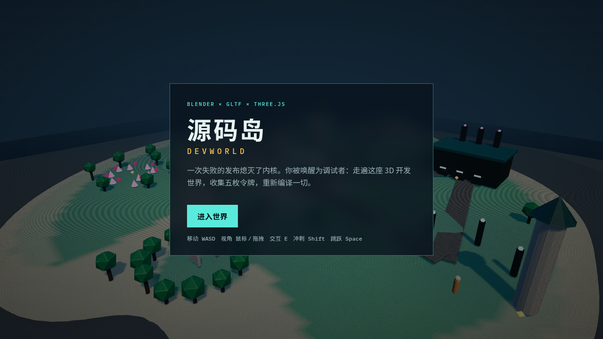

# 源码岛 Devworld

一款可以玩的第一人称 3D 开发世界。岛屿、建筑和道具在 **Blender 4.2 LTS** 里程序化建模，经 **glTF 2.0** 交给浏览器里的 **Three.js** 运行时：走路、跳跃、对话、除虫、点亮信标、修流水线，收集五枚令牌后重新编译这个世界。



## 怎么玩

```bash
cd game
npm install
npm run dev
```

浏览器打开终端里给出的地址（默认 `http://localhost:5173`）。

| 操作 | 按键 |
| --- | --- |
| 移动 | WASD / 方向键 |
| 视角 | 鼠标（点击画面锁定指针，或拖拽） |
| 冲刺 | Shift |
| 跳跃 | Space |
| 交互 | E |
| 手电 | F |
| 任务 | Tab |
| 暂停 | Esc |

目标：在**终端广场**听艾达说明情况，然后走遍五个街区拿到令牌，回到**编译尖塔**完成最终编译。

1. **Git 峡谷**（西）— 拾取分支令牌  
2. **除虫沼泽**（西南）— 靠近空指针虫完成调试  
3. **API 港湾**（东）— 点亮三座信标  
4. **CI 工厂**（东北）— 修复三条流水线节点  
5. **着色峰**（北）— 沿石阶上山取辉光令牌  

## 专业管线

资产不手摆网格，而是一条可复现的 DCC 管线，详见 [PIPELINE.md](PIPELINE.md)。

```bash
# 需要本机安装 Blender 4.2+
export BLENDER=/path/to/blender
./scripts/build_assets.sh
```

1. **Pillow** 生成可平铺 albedo（石板、灰泥、金属、树皮…）  
2. **Blender** 脚本雕塑岛屿高度场、街区、碰撞盒与交互标记  
3. 导出 `assets/models/devworld.glb` + `assets/data/world.json`  
4. **Three.js + Vite** 加载场景，处理移动、碰撞、任务与 HUD  

仓库已包含预构建 glTF，所以没有 Blender 也能直接玩。
