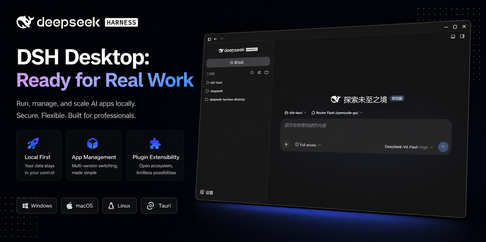
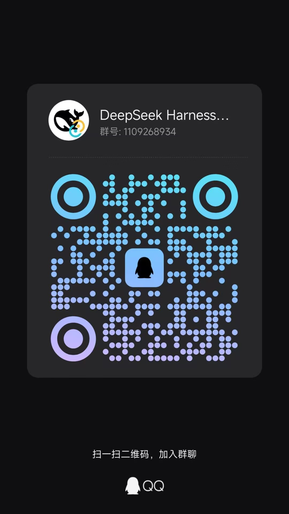

<p align="center">
  <a href="https://github.com/dsh-tauri/deepseek-harness-desktop">
    
  </a>
</p>

<h1 align="center">DeepSeek Harness Desktop</h1>

<p align="center">
  Ejecuta <a href="https://github.com/deepseek-ai/deepseek-harness">DeepSeek Harness</a> en tu escritorio, al instante —<br />
  sin Node.js, sin pnpm, sin Docker. Descarga, instala y listo.
</p>

<p align="center">
  <a href="https://github.com/dsh-tauri/deepseek-harness-desktop/releases">
    
  </a>
  
  
  
  
  
</p>

<p align="center">
  <samp><a href="./README.en.md">English</a> · <strong>Español</strong> · <a href="https://dshtauri.mintlify.site">Documentación</a> · <a href="./README.md">中文</a></samp>
</p>

<p align="center">
 <a href="https://trendshift.io/repositories/151676?utm_source=trendshift-badge&amp;utm_medium=badge&amp;utm_campaign=badge-trendshift-151676" target="_blank" rel="noopener noreferrer"></a>
</p>

<p align="center">
  <a href="docs/PREVIEW.md">
    
  </a>
</p>

## Características

- ⚡️ **Cero configuración** — No tenés que instalar Node ni el núcleo Harness manualmente: el primer arranque descarga solo lo que falte (necesita conexión en ese momento) y reutiliza tu entorno local sin modificarlo.
- 🔄 **Actualización del núcleo** — Sincroniza la última versión del Harness oficial dentro de la app, los cambios surten efecto sin reinstalar; permite gestionar múltiples versiones del núcleo.
- 🖥️ **Configuración** — Un solo diálogo para Debug / Perfiles / Plugins / Núcleo, con etiquetas bilingües (zh/en) y soporte de modo oscuro.
- 🗂️ **Aislamiento por perfiles** — Los perfiles están aislados entre sí en la configuración; plugins, parches y ajustes se mantienen independientes sin interferirse.
- 🧩 **Gestión de plugins** — El panel de plugins administra los instalados; ante un problema ofrece entradas de actualización / desinstalación más detalles del error.
- 🎁 **Plugins integrados** — Incluye plugins empaquetados; más plugins integrados de calidad en camino.
- 🪶 **Nativo y liviano** — Un shell Tauri 2 (no Electron): instaladores más chicos, menos memoria, ventanas nativas.
- ⌨️ **Integración con la terminal** — La instalación registra automáticamente el comando `dsh`, listo en una terminal nueva; no sobrescribe tu configuración actual del shell.
- 🧭 **Asistente inicial** — En el primer arranque elegí los plugins recomendados, o volvé a elegirlos más tarde en la configuración.
- 🚀 **Auto-actualización** — Actualizaciones dentro de la app; sin volver a descargar.
- 🐾 **Mascotas de escritorio** — Administrá fuentes Pets y Codex con presets listos para usar (los recursos se cargan bajo demanda desde GitHub y se cachean localmente en IndexedDB para un mejor rendimiento, sin necesidad de descargas manuales), importá paquetes Codex `.zip` y mostrá estados de actividad de las conversaciones.

## Preinstalados

Plugins ofrecidos en el asistente del primer arranque; marcá los que necesites e instalalos a demanda:

- [DSH Market](https://github.com/dsh-market/dsh-market) — explorá, buscá e instalá plugins de la comunidad con un clic (Recomendado)
- [DSH Better Sidebar](https://github.com/omdsh-dev/DSH-better-sidebar) — barra lateral derecha estilo VSCode, aislada por sesión (Recomendado)
- [DSH Rewind](https://github.com/SiriLee/dsh-rewind) — retroceso de conversación dentro de la misma ventana, sin crear una sesión nueva, más una copia de seguridad liviana del espacio de trabajo que restaura los archivos junto con el retroceso (Recomendado)

> La lista de preinstalados la mantiene el proyecto desktop. Para pedir un preset nuevo o actualizado, abrí un issue en [deepseek-harness-desktop](https://github.com/dsh-tauri/deepseek-harness-desktop/issues).

## Plugins integrados

Plugins propios incluidos con el instalador:

- [DSH Tauri](https://github.com/dsh-tauri/deepseek-harness-desktop/tree/main/packages/dsh-tauri) — provee el canal de comunicación con el shell Tauri 2, y permite que el WebView integrado en un sandbox de origen cruzado alcance el Host de loopback sobrescribiendo las dos puertas de autenticación del carrier de escritorio en el servicio `connection`
- [DSH Tauri UI](https://github.com/dsh-tauri/deepseek-harness-desktop/tree/main/packages/dsh-tauri-ui) — provee una barra lateral de ajustes personalizada para el shell Tauri 2
- [DSH Tauri Worktree](https://github.com/dsh-tauri/deepseek-harness-desktop/tree/main/packages/dsh-tauri-worktree) — crea un Git worktree aislado por sesión, con checkout a rama local o flujos de archivar-y-abandonar
- [DSH Tauri Panel Extension](https://github.com/dsh-tauri/deepseek-harness-desktop/tree/main/packages/dsh-tauri-panel-extension) — gestión de Skills y MCP con importación de repositorios de skills, más un panel del mercado de plugins integrado
- [DSH Tauri Panel Scheduler](https://github.com/dsh-tauri/deepseek-harness-desktop/tree/main/packages/dsh-tauri-panel-scheduler) — crea tareas programadas diarias, por intervalo, días hábiles y semanales; las ejecuta en sesiones Agent independientes y conserva el historial
- [DSH Running Changes](https://github.com/dsh-tauri/deepseek-harness-desktop/tree/main/packages/dsh-tauri-running-changes) — registra snapshots Git privados por turno del Agent y muestra un chip sobre la entrada mientras el turno está en curso; la restauración de archivos la realiza el plugin recomendado dsh-rewind
- [DSH Tauri Session](https://github.com/dsh-tauri/deepseek-harness-desktop/tree/main/packages/dsh-tauri-session) — reemplaza el borrado de workspaces por archivado y agrega una página de chats archivados con búsqueda, orden, agrupado, filtro por proyecto y restauración
- [DSH Tauri Pet](https://github.com/dsh-tauri/deepseek-harness-desktop/tree/main/packages/dsh-tauri-pet) — administra mascotas Chat / Codex, descargas de presets, importación de paquetes y estados de actividad
- [DSH Tauri Rightclick](https://github.com/dsh-tauri/deepseek-harness-desktop/tree/main/packages/dsh-tauri-rightclick) — menús contextuales estilo nativo para sesiones, workspaces, texto, enlaces y entradas
- [DSH Tauri Model Config](https://github.com/dsh-tauri/deepseek-harness-desktop/tree/main/packages/dsh-tauri-model-config) — permite seleccionar modelos y configurar sus parámetros
- Más plugins en camino...

## Inicio rápido

Descargá el instalador de tu plataforma desde [Releases](https://github.com/dsh-tauri/deepseek-harness-desktop/releases), instalá y abrí.

**macOS (Homebrew):** también podés instalarlo con un comando vía Homebrew:

```bash
brew install dsh-tauri/desktop/deepseek-harness
```

El primer arranque descarga el runtime de Node y el núcleo Harness (si `dsh` ya está instalado, se usa la versión instalada), y te lleva directo al harness en `http://127.0.0.1:3080`; después todo corre local, sin red.

**Requisitos:** Windows 10+ · macOS 10.15+ · Linux (AppImage / .deb) · red en el primer arranque · núcleo Harness **0.1.5-rc.1** o superior

> **Nota Wayland en Linux (PikaOS / GNOME Wayland / Ubuntu 22.04+):** el AppImage puede crashear o verse negro en Wayland por WebKitGTK; la app corrige sola el caso común. <details><summary>Si igual crashea / se ve negro:</summary><br>**Preferí el `.deb`** (verificado en PikaOS 4 Wayland), o ejecutá a mano `WEBKIT_DISABLE_COMPOSITING_MODE=1 WEBKIT_DISABLE_DMABUF_RENDERER=1 GDK_BACKEND=x11 ./AppImage`. Si no aparecen los iconos, copiá los iconos `hicolor` de la app a `~/.local/share/icons` y ejecutá `update-desktop-database`.<br></details>
>
> **Linux de liberación continua arranca y muere al instante (Arch / CachyOS / Fedora, …):** los AppImage antiguos empaquetaban las librerías de la pila de display de la imagen de build (Ubuntu 22.04), como `libwayland-client`. Un Mesa más nuevo del sistema es incompatible a nivel ABI con ellas, así que `WebKitWebProcess` llama a `abort()`: la app **no muestra ninguna ventana ni ningún log**. El build ya elimina esas librerías (ver `.github/workflows/build-linux.yml` y `scripts/fix-appimage-host-libs.sh`); usá una versión publicada después de ese cambio. Si igual te afecta, usá el `.deb`, o `LD_PRELOAD=/usr/lib/libwayland-client.so.0 ./AppImage` (ajustá la ruta según tu distro).

## Comunidad

- [Unite a la comunidad de Discord](https://discord.gg/RT9As6Cj8B)

<table>
  <tr>
    <td align="center"><strong>Grupo QQ</strong><br /></td>
    <td align="center"><strong>Grupo WeChat</strong><br /></td>
  </tr>
</table>

## Desarrollo

¿Querés participar del desarrollo? Mirá [docs/DEVELOPMENT.md](./docs/DEVELOPMENT.md).

## Cómo funciona

```text
┌──────────────────────────────────────────────┐
│ Tauri WebView (React)                        │
│   máquina de estados → progreso → iframe     │
│   carga la UI web de dsh + controles         │
└──────────────────────┬───────────────────────┘
                       │ comandos invoke + eventos
┌──────────────────────┴───────────────────────┐
│ Backend Rust (Tauri)                         │
│   service/download  instalador + extracción  │
│   service/core      versiones del núcleo     │
│   service/profile   gestión de perfiles dsh  │
│   service/plugin    quitar / actualizar      │
│   service/cli       shim del comando + PATH  │
│   service/update    auto-actualización       │
│   service/workflow  ciclo de vida de dsh     │
│   task              health checks            │
└──────┬───────────────────────────┬───────────┘
       │                           │
  runtime/ (Node.js v22.22.0)   dependencies/dsh/ (paquete prearmado)
       └─────────────┬─────────────┘
                     ▼
   dsh --profile <perfil> --host 127.0.0.1 --port 3080
                     │  DSH_HOME=~/.dsh
                     ▼
        http://127.0.0.1:3080/  ← UI integrada
```

El paquete Harness prearmado lo publica [deepseek-harness-pkg](https://github.com/dsh-tauri/deepseek-harness-pkg). Cada arranque compara contra el último release y te propone descargar si el local quedó viejo — conservando lo local si GitHub es inalcanzable. Un núcleo local instalado vía CLI tiene preferencia si existe.

## Notas

> [!WARNING]
> **Vista previa** — el `dsh` oficial evoluciona rápido con cambios incompatibles; este proyecto lo sigue de cerca.
>
> [!NOTE]
> **Seguridad** — `dsh` puede ejecutar código en tu máquina. Solo para aprender / investigar / probar; usalo en un entorno confiable y aislado.

## Relacionados

- [deepseek-harness](https://github.com/deepseek-ai/deepseek-harness) — la plataforma agent `dsh` oficial
- [deepseek-harness-pkg](https://github.com/dsh-tauri/deepseek-harness-pkg) — paquetes Harness prearmados que consume esta app

### Fuentes de datos de los plugins

Recursos remotos y catálogos oficiales que los plugins consumen en tiempo de ejecución:

- [PC2005-cloud/dsh-pet](https://github.com/PC2005-cloud/dsh-pet) — recursos de las mascotas predefinidas (movimientos WebM, GIF de vista previa, `config.jsonc`); `preset-pets.json` fija `e1ff8c1`
- [dsh-tauri/dsh-pet-mov](https://github.com/dsh-tauri/dsh-pet-mov) — espejo `.mov` HEVC-alpha para macOS (WKWebView no soporta VP9-alpha), fijado en `be0f3bb`
- [hairyf/dsh-pet-component](https://github.com/hairyf/dsh-pet-component) — componente de render de la mascota (npm `dsh-pet-component`)

### Subrepositorios de los plugins

Repositorios de referencia clonados en `source/` según los necesita cada plugin; la mayoría no se versiona en este repositorio:

- [PC2005-cloud/dsh-pet](https://github.com/PC2005-cloud/dsh-pet) — pesos de movimiento, reproducción continua y estilo de burbujas (submódulo)
- [Skylarking/dsh-plugin-codex-pets](https://github.com/Skylarking/dsh-plugin-codex-pets) — atlas de mascotas Codex y mapeo de estado de sesión (submódulo)
- [ayangweb/BongoCat](https://github.com/ayangweb/BongoCat) — referencia de ventana Tauri, arrastre nativo, DPI y paso del ratón (submódulo)
- [QCYTSN/dsh-dafeiyu](https://github.com/QCYTSN/dsh-dafeiyu) — referencia de textos de burbuja y prioridad de estados (submódulo)

## Licencia

[MIT](./LICENSE) con [condición no comercial](./LICENSE.details) © deepseek-harness-desktop contributors
